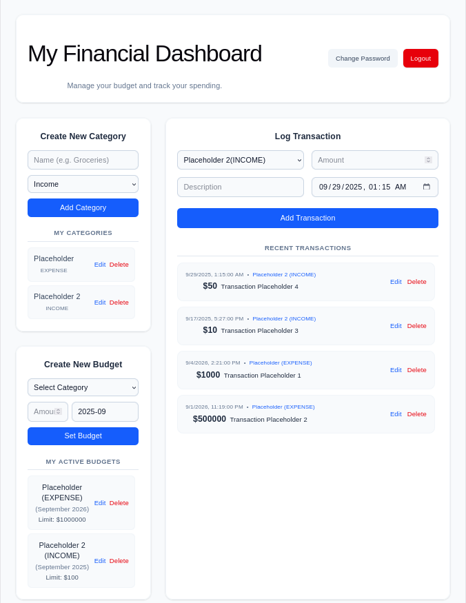
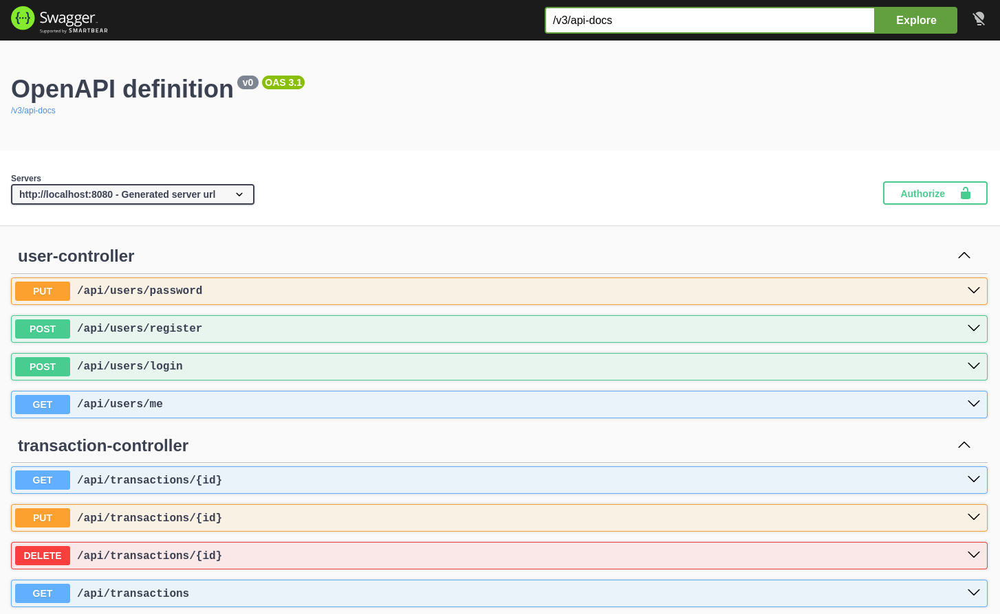

# SB-Tracker - Full-Stack Personal Finance Dashboard

## Project Overview
A comprehensive personal finance dashboard built with **React (Vite/Tailwind)** and **Spring Boot 4**. This application allows users to securely track transactions, manage monthly budgets, and categorize expenses. It focuses heavily on data integrity, responsive UI design, and robust full-stack security.

---

## Screenshots

### Main Dashboard


### Swagger API Docs


---

## Technical Stack
* **Frontend:** React, Vite (Port `5173`), Tailwind CSS, Axios
* **Backend:** Java 25, Spring Boot 4.1.0 (Port `8080`), Spring Security, Spring Data JPA
* **Database:** PostgreSQL
* **Documentation:** Swagger UI / OpenAPI

---

## Core Architecture & Technical Solutions

### 1. Security & Communication
* **JWT Authentication:** User sessions are secured via JSON Web Tokens. The secret key is externalized securely via `application.properties`.
* **Data Izolation:** Strict security rules ensure each user can exclusively access and manage only their own transaction data.
* **CORS Configuration:** Explicitly configured to allow cross-origin communication between the Vite frontend (`http://localhost:5173`) and the backend.

### 2. Database & Data Integrity
* **Strict Constraints:** Transaction amounts are capped at `DECIMAL(10, 2)` to prevent overflow. 
* **Category Uniqueness:** A `@UniqueConstraint` on the database level ensures no duplicate categories exist for a specific user (`user_id`, `name`, `type`).
* **Enum Handling:** Category types (`INCOME`, `EXPENSE`) are stored as readable strings in PostgreSQL using `@Enumerated(EnumType.STRING)` and passed to the frontend DTOs using `.name()`.

### 3. Backend Error Handling & Validation
* **DTO-Level Validations:** Strict input control is enforced directly at the DTO level using annotations like `@NotNull` and `@Positive` to prevent invalid data from processing.
* **Global Exception Handler:** A `@ControllerAdvice` globally intercepts exceptions and returns clean JSON errors for the frontend.
* **Optimized Aggregation:** Uses optimized JPA aggregate queries (with `GROUP BY`) to generate monthly expense reports.

### 4. Frontend UI/UX Details
* **CSS Grid Layout:** Ensures the dashboard remains fully responsive.
* **HTML5 Form Validation:** Edit modes for Categories, Budgets, and Transactions are wrapped in `<form onSubmit={...}>` tags to utilize native browser validation (`max`, `required`) during inline edits.
* **Text-Based Inline Deletion:** Replaces jarring browser popups with a sleek, compact `Sure? Yes | No` inline text toggle.

---

## Local Development Setup

### Backend (Spring Boot)
1. Create a PostgreSQL database named `sb_tracker`.
2. Open `src/main/resources/application.properties` and configure your settings:
   ```properties
   spring.application.name=sb-tracker
   
   #Database Configuration
   spring.datasource.url=jdbc:postgresql://localhost:5432/sb_tracker
   spring.datasource.username=your_username
   spring.datasource.password=your_password
   spring.jpa.hibernate.ddl-auto=update

   #JWT Configuration
   jwt.secret=your_super_secret_key_here
   jwt.expiration=duration(in miliseconds)
   ```
3. Run the application. The backend will start on `http://localhost:8080`.

### Frontend (React/Vite)
1. Navigate to the frontend directory.
2. Install the required dependencies:
   ```bash
   npm install
   ```
3. Start the Vite development server:
   ```bash
   npm run dev
   ```
4. Access the dashboard at `http://localhost:5173`.

---

## REST API & Documentation

### Interactive API Documentation
* **Swagger UI:** Once the backend is running, the interactive OpenAPI documentation is accessible at `http://localhost:8080/swagger-ui.html`.

### User (/api/users)
* `POST /login` - Authenticate and retrieve a JWT token.
* `POST /aregister` - Create a new user account.
* `PUT /password` - Change password.
* `GET /me` - Get account information.

### Categories (/api/cateogries)
* `GET` - Retrieve all categories for the authenticated user.
* `POST` - Create a new category.
* `PUT /{id}` - Update a category (validates against duplicates).
* `DELETE /{id}` - Delete a category (cascades to transactions/budgets).

### Budgets (/api/budgets)
* `GET` - Retrieve all active budgets.
* `POST` - Create a new monthly budget limit.
* `PUT /{id}` - Update a budget limit and active month.
* `DELETE /{id}` - Delete a budget.

### Transactions (/api/transactions)
* `GET` - Retrieve user transactions.
* `POST` - Log a new transaction.
* `PUT /{id}` - Update an existing transaction.
* `DELETE /{id}` - Delete a transaction.
