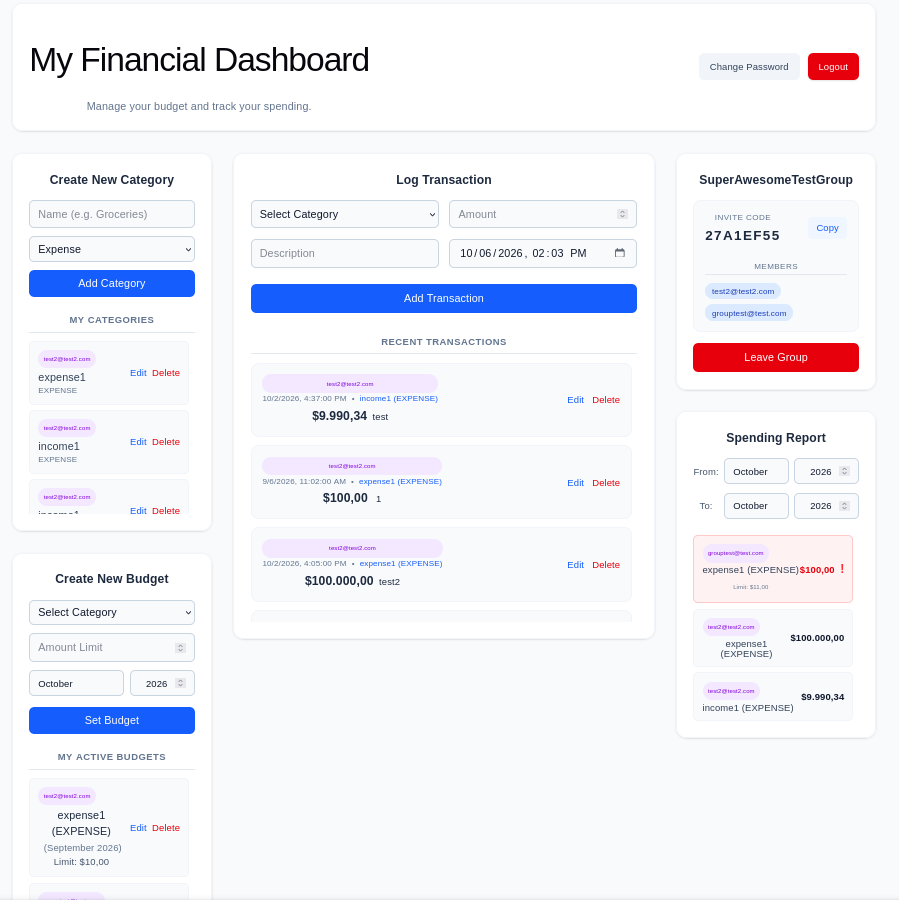
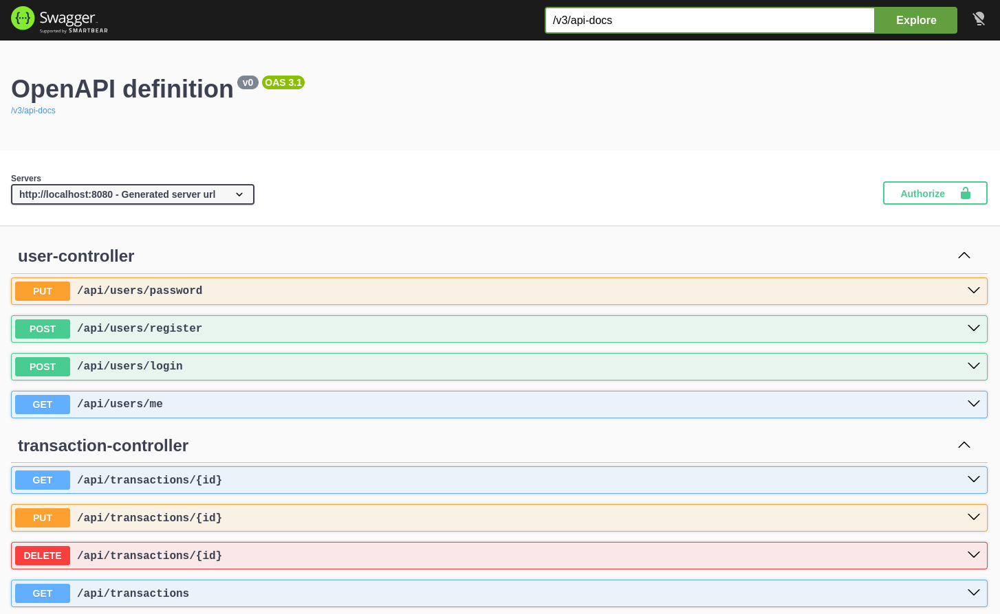

# SB-Tracker - Full-Stack Real-Time Personal Finance Dashboard

## Project Overview
A comprehensive, real-time collaborative personal finance dashboard built with **React (Vite/Tailwind)** and **Spring Boot 4**. This application allows users to securely track transactions, manage monthly budgets, and categorize expenses, with full support for shared group accounts. It focuses heavily on data integrity, responsive UI design, live data synchronization, and robust full-stack security.

---

## Screenshots

### Main Dashboard


### Swagger API Docs


---

## Technical Stack
* **Frontend:** React, Vite (Port `5173`), Tailwind CSS, Axios, `@stomp/stompjs` (WebSockets)
* **Backend:** Java 25, Spring Boot 4.1.0 (Port `8080`), Spring Security, Spring Data JPA, Spring WebSocket (STOMP)
* **Database:** PostgreSQL
* **Documentation:** Swagger UI / OpenAPI

---

## Core Architecture & Technical Solutions

### 1. Security & Real-Time Communication
* **JWT Authentication:** User sessions are secured via JSON Web Tokens. The secret key is externalized securely via `application.properties`.
* **WebSocket Security:** Real-time STOMP WebSocket connections are secured using a custom JWT-based `ChannelInterceptor` during the handshake phase.
* **Live Synchronization:** Utilizes `SimpMessagingTemplate` to broadcast `REFRESH_TRANSACTIONS` events, ensuring all active group members see data updates instantly without refreshing the page.
* **CORS Configuration:** Explicitly configured with wildcard patterns to allow cross-origin communication between the Vite frontend (including local network testing) and the backend.

### 2. Database & Data Integrity
* **Strict Constraints:** Transaction amounts are capped at `DECIMAL(10, 2)` to prevent overflow. 
* **Category Uniqueness:** A `@UniqueConstraint` on the database level ensures no duplicate categories exist for a specific user (`user_id`, `name`, `type`).
* **Enum Handling:** Category types (`INCOME`, `EXPENSE`) are stored as readable strings in PostgreSQL using `@Enumerated(EnumType.STRING)` and passed to the frontend DTOs using `.name()`.

### 3. Backend Error Handling & Dynamic Aggregation
* **DTO-Level Validations:** Strict input control is enforced directly at the DTO level using annotations like `@NotNull` and `@Positive` to prevent invalid data from processing.
* **Global Exception Handler:** A `@ControllerAdvice` globally intercepts exceptions and returns clean JSON errors for the frontend.
* **Dynamic Date-Range Aggregation:** Uses optimized JPA aggregate queries (with `GROUP BY`) to generate expense reports based on flexible `startDate` and `endDate` parameters, accurately summing specific monthly budget limits across the requested timeframe.
* **Contextual Data Fetching:** Service layer automatically branches data-fetching logic based on role (Admin, Group Member, or Solo User) to map attribution correctly.

### 4. Frontend UI/UX Details
* **CSS Grid Layout:** Ensures the dashboard remains fully responsive.
* **Attribution Badges:** Transactions and budgets display clean `ownerEmail` badges when viewed in a group or admin context, leveraging conditional DTO mapping.
* **HTML5 Form Validation:** Edit modes for Categories, Budgets, and Transactions are wrapped in `<form onSubmit={...}>` tags to utilize native browser validation (`max`, `required`) during inline edits.
* **Text-Based Inline Deletion:** Replaces jarring browser popups with a sleek, compact `Sure? Yes | No` inline text toggle.

---

## Local Development Setup

### Backend (Spring Boot)
1. Create a PostgreSQL database named `sb_tracker`.
2. Open `src/main/resources/application.properties` and configure your settings:
   ```properties
   spring.application.name=sb-tracker
   
   #Database Configuration
   spring.datasource.url=jdbc:postgresql://localhost:5432/sb_tracker
   spring.datasource.username=your_username
   spring.datasource.password=your_password
   spring.jpa.hibernate.ddl-auto=update

   #JWT Configuration
   jwt.secret=your_super_secret_key_here
   jwt.expiration=duration(in miliseconds)
   ```
3. Run the application. The backend will start on `http://localhost:8080`.

### Frontend (React/Vite)
1. Navigate to the frontend directory.
2. Install the required dependencies:
   ```bash
   npm install
   ```
3. Start the Vite development server:
   ```bash
   npm run dev
   ```
4. Access the dashboard at `http://localhost:5173` (or via your local network IP for cross-device testing).

---

## REST API & Documentation

### Interactive API Documentation
* **Swagger UI:** Once the backend is running, the interactive OpenAPI documentation is accessible at `http://localhost:8080/swagger-ui.html`.

### User (/api/users)
* `POST /login` - Authenticate and retrieve a JWT token.
* `POST /register` - Create a new user account.
* `PUT /password` - Change password.
* `GET /me` - Get account information (includes group context).

### Group (/api/groups)
* `POST` - Create a new group.
* `POST /join` - Join an existing group.
* `POST /leave` - Leave your current group.

### Categories (/api/categories)
* `GET` - Retrieve all categories for the authenticated user/group.
* `POST` - Create a new category.
* `PUT /{id}` - Update a category (validates against duplicates).
* `DELETE /{id}` - Delete a category (cascades to transactions/budgets).

### Budgets (/api/budgets)
* `GET` - Retrieve all active budgets for the user/group.
* `POST` - Create a new monthly budget limit.
* `PUT /{id}` - Update a budget limit and active month.
* `DELETE /{id}` - Delete a budget.

### Transactions (/api/transactions)
* `GET` - Retrieve user/group transactions.
* `GET /report` - Retrieve aggregated spending data and budget limits bounded by `startDate` and `endDate`.
* `POST` - Log a new transaction (triggers WebSocket refresh).
* `PUT /{id}` - Update an existing transaction (triggers WebSocket refresh).
* `DELETE /{id}` - Delete a transaction (triggers WebSocket refresh).
